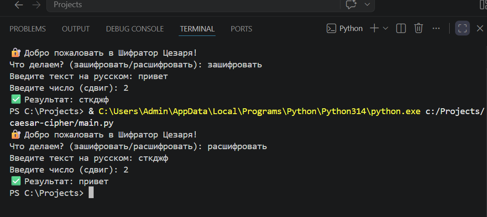

# 🔐 Шифратор Цезаря (Caesar Cipher)

Простой и надежный инструмент для шифрования и расшифровки текстовых сообщений на кириллице. Использует классический алгоритм сдвига, известный еще со времен Древнего Рима.

---

### 📸 Демонстрация работы:


### ⚙️ Как это работает:
Программа берет каждую букву вашего текста и заменяет её на другую, стоящую в алфавите на фиксированное число позиций (шаг сдвига) дальше или раньше. 

**Пример (сдвиг 2):**
* `п` -> `с`
* `р` -> `т`
* `и` -> `к`

### 🛠 Особенности реализации:
* **Поддержка кириллицы:** Полный алфавит от `а` до `я`.
* **Циклический сдвиг:** Если сдвиг выходит за пределы буквы `я`, он автоматически возвращается к началу алфавита.
* **Сохранение знаков:** Пробелы, знаки препинания и цифры остаются на своих местах, не изменяясь.
* **Двойной режим:** Один и тот же скрипт умеет и прятать послание, и возвращать его в читаемый вид.

### 🚀 Запуск:
1. Скачайте `main.py`.
2. Запустите через терминал:
   ```bash
   python main.py
